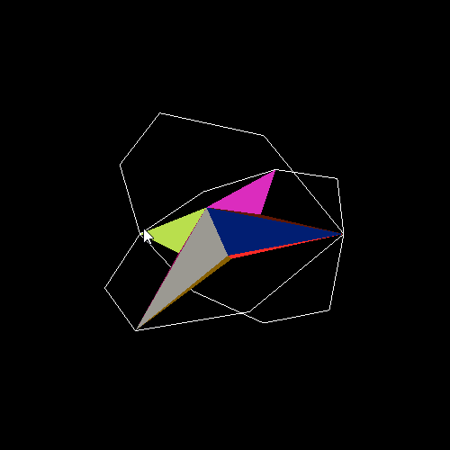

In Fall 2024, I took Intro to Computer Graphics with Mike Bailey. It was my first time learning computer graphics in an academic setting, and over the course of ten weeks we covered a wide range of foundational topics—from a brief history of computer graphics to core OpenGL concepts like lighting, keyframe animation, display lists, and the graphics pipeline.

Through weekly assignments, we worked hands-on with many of the fundamentals: transformations in 3D space, basic lighting models, animation, texture mapping, and introductory shaders. For the <a href="/projects/cs450-final-project" target="_blank" rel="noopener noreferrer">final project</a>, we were given the freedom to build something open-ended using the concepts we had learned throughout the term. I chose to create a rudimentary, <a href="/projects/cs450-final-project" target="_blank" rel="noopener noreferrer">interactive 3D version of Pac-Man</a>, which combined basic rendering, animation, and user interaction.

That said, if I’m being completely honest, a lot of the low-level OpenGL details have faded since then. I remember learning about important concepts like the z-buffer, rasterization, depth testing, luminance, and dithering—but many of them exist more as buzzwords in my head than tools I can confidently apply right now.

In Winter 2025, I followed that course with a Special Topics class in Computer Graphics. This course was more discussion- and research-focused. We briefly reviewed some graphics principles, but most of the term was spent working in groups to present research papers to the class. My presentation focused on Perlin noise and its applications in procedural generation. Alongside that, we completed a few assignments in Blender, including modeling and rendering a Cornell Box with multiple geometries and materials.

It’s been some time since taking both of these classes, and I’ve realized that while they gave me exposure to many ideas in graphics, I want a stronger and more active understanding of the fundamentals. Because of that, I’ve decided to essentially start from scratch and work through the LearnOpenGL tutorial from beginning to end. My goal is to rebuild my foundation deliberately and fill in the gaps that time and coursework alone didn’t solidify.

Once I feel more confident with OpenGL again, I plan to jump into a first personal project—possibly recreating my 3D Pac-Man game, or experimenting with my own implementation of Perlin noise for something like procedural terrain generation. For now, though, the focus is on relearning, practicing, and building a solid base to grow from.
