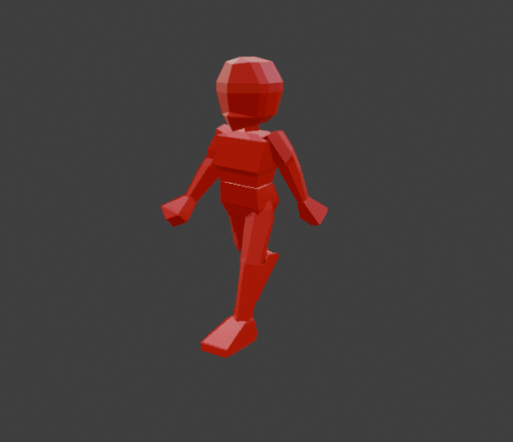
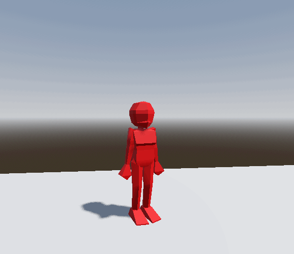

I know I haven’t posted any blog updates in the last couple of weeks, but that doesn’t mean I haven’t been learning anything cool. Life’s just been busy with school and work. That said, these past two weeks I finally did something I’ve been flirting with for almost five years: I started learning Blender—for real this time.

Blender was always super daunting to me. If you’ve ever opened it for the first time, you know what I mean. It’s hard to even figure out how to navigate the viewport, let alone actually make something. The first time I opened Blender was probably around five years ago. Back then, I followed a tutorial to model a low-poly human character, set up a basic armature, and do a little bit of animation. I’m pretty sure I still have some videos of it saved somewhere… but I can’t find them right now.

That first attempt didn’t really stick. After making that one simple model and animating it a bit, I more or less forgot about Blender. Since then, about once a year, I’d launch it again, try modeling something, get overwhelmed, and quietly sweep it under the rug.

This time was different.

My YouTube recommendations had been feeding me way too much game dev content, and I decided it was finally time to sit down and actually commit. I fired up Blender, watched a few tutorials to refresh myself on the basics—modeling, creating an armature, and this time setting up a proper rig—and then made a simple character to get started. I skipped texturing for now because this was meant to be a low effort first pass at making and animating a character.

This is what I ended up with:

I was honestly pretty proud of how the walk cycle turned out.

While animating, something interesting happened. As I scrubbed through Blender’s Dope Sheet and started placing keyframes, this baseline knowledge of animation principles that I’d completely forgotten about came flooding back. It reminded me of my senior year of high school (which was fully online thanks to the pandemic), when I took a 2D animation class. I had totally forgotten I even took that class, but apparently the fundamentals really stuck.

After finishing the walk cycle, I wanted to take things a step further and see what it would be like to get my Blender models and animations into Godot, which is still my game engine of choice. I quickly made an idle and a run cycle animation to accompany the walk cycle, then exported everything and pulled it into Godot.

The process was surprisingly straightforward. Within no time, I had my character rigged up to a CharacterBody3D, animations hooked up, and the model walking around an empty scene. My run cycle got a little messed up whe importing to Godot. I figured out it was something wrong wiht how I was exporting my deformation bones, but as this was a first pass intended for learning the workflow I didnt bother to correct it this time around.

Seeing my own animated character moving around in-engine for the first time was very motivating. That first pass—modeling, rigging, animating, exporting, and controlling a character in Godot—sparked a whole new level of excitement for me. It pushed me to start thinking about a more focused and organized project, which I’ve already begun working on.

I’ll save the details on that for a separate post, but… stay tuned 👀