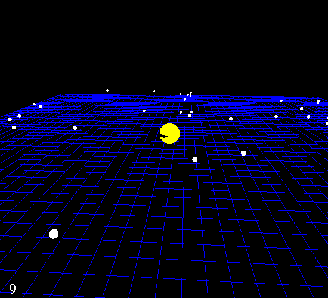

## 3D Pac-Man (OpenGL)

For the open-ended final project in my CS450 Intro to Computer Graphics course, I built a simple, rudimentary 3D version of Pac-Man using OpenGL. The goal of the project was to propose and implement something of our own, as long as it applied concepts we had learned throughout the term.

My implementation focused on combining several of those fundamentals into a small interactive experience. Pac-Man features a basic mouth animation, simple keyboard controls for player movement, and collision detection with pellets scattered throughout the environment. Collecting pellets increments a score, which is rendered as text directly to the screen.

Overall, the project is a fairly crude 3D interpretation of Pac-Man, but it was a fun and valuable exercise. It was my first time using a low-level graphics API like OpenGL to build something that actually resembles a video game, and it helped solidify how individual graphics concepts can come together to form an interactive program.
