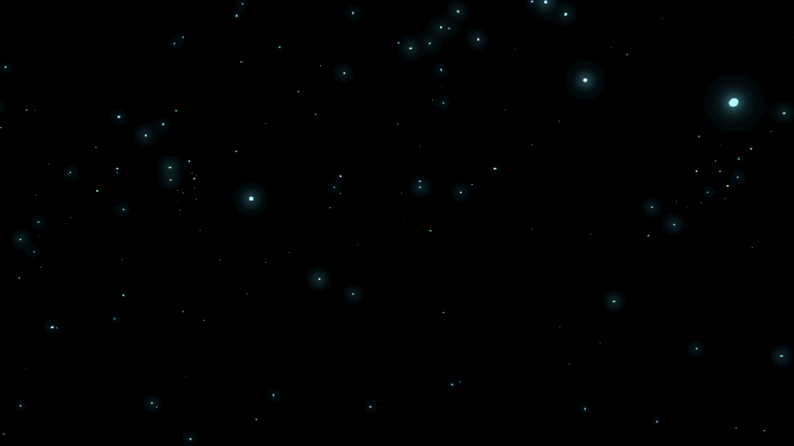

Independent research project advised by Dr. Yue Zhang at Oregon State University. This project is an interactive Unity application that lets users explore the scale of the universe by navigating a 3D visualization of 4,000+ real pulsars, inspired by the pulsar maps engraved on the Voyager Golden Record.

I sourced and processed astronomical data from the [Australia Telescope National Facility (ATNF) Pulsar Catalogue](https://www.atnf.csiro.au/research/pulsar/psrcat/) to populate an accurate 3D star field of pulsar positions. Each pulsar is placed using real distance data, so the resulting scene reflects the actual, wildly uneven distribution of pulsars around us rather than an artistic approximation.

To make those distances explorable, I built a free-flight navigation system that lets users move through space and manually scale the scene — helping make cosmic distances more intuitive when the numbers involved (measured in parsecs) are otherwise hard to grasp.

Up close, each pulsar's spin is driven by its real, catalogued rotation period rather than an arbitrary animation, so the pulsing you see corresponds to how fast that neutron star actually spins.

One mode replicates the pulsar map engraved on the Voyager Golden Record — a diagram that uses pulsars as cosmic landmarks to indicate Earth's location to any spacefaring civilization that might one day find it. Seeing that same map rendered as an explorable 3D scene, rather than a static engraving, was one of the most satisfying parts of the project.

I independently designed and developed the full project — from the data pipeline to the 3D scene and interaction system — under Dr. Zhang's guidance.

## What I Learned

- Working with astronomical distance standards (parsecs) and converting catalog data into usable 3D coordinates
- Techniques for representing vast, unevenly distributed cosmic scales in a way that stays interactive and explorable
- Building free-flight camera and scene-scaling systems in Unity
- Structuring a data pipeline that turns a raw astronomical catalogue into a populated real-time 3D scene
